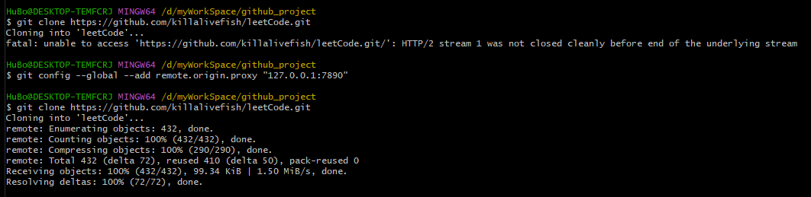

linux 安装git  
[https://www.cnblogs.com/ios9/p/14621012.html](https://www.cnblogs.com/ios9/p/14621012.html)

# pro git

[https://git-scm.com/book/zh/v2](https://git-scm.com/book/zh/v2)

# git 命令

[https://gitee.com/all-about-git](https://gitee.com/all-about-git)

# 各种gitignore

[https://github.com/github/gitignore](https://github.com/github/gitignore)

# 一些命令

- git diff --staged
- git log --stat  提交的简略统计信息
- git rm --cached add.txt 从暂存区移除文件
- git commit --amend 修改提交
- git remote show origin 查看远端信息
- git config --global --add remote.origin.proxy "127.0.0.1:(proxy http port number)" 有代理时加上这个配置才能正常clone下来
- cat ~/.gitconfig
-  git rm -r --cached ignoreFile 去掉已经tracking的文件
- [https://blog.csdn.net/Jessica_hhh/article/details/133142630](https:/blog.csdn.net/Jessica_hhh/article/details/133142630)

[https://git-scm.com/book/zh/v2/Git-%E5%88%86%E6%94%AF-%E8%BF%9C%E7%A8%8B%E5%88%86%E6%94%AF](https://git-scm.com/book/zh/v2/Git-%E5%88%86%E6%94%AF-%E8%BF%9C%E7%A8%8B%E5%88%86%E6%94%AF)