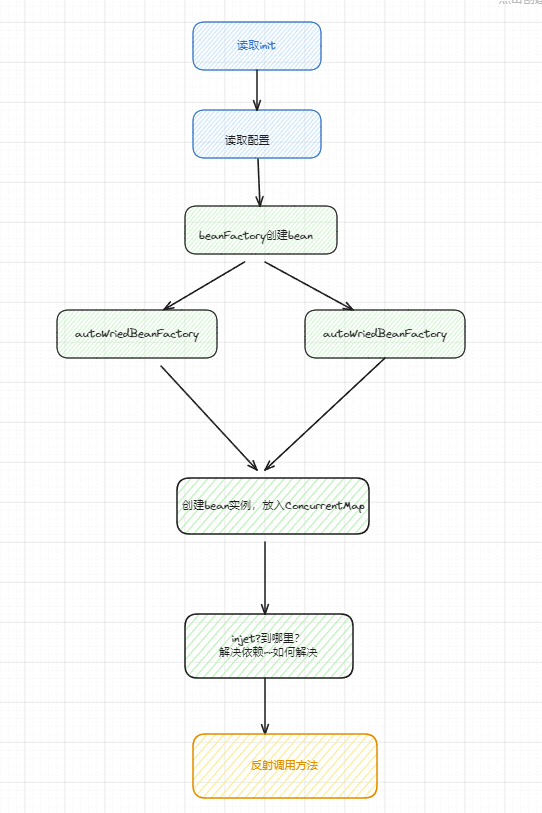

## Spring 笔记

> ***spring 官方文档***       [https://springdoc.cn/docs/](https://springdoc.cn/docs/)

## IOC

对象的创建由Spring来处理


````
ClassPathBeanDefinitionScanner
会读取配置了扫描注解的类
````

### 1.1 Bean的创建

依赖注入+控制反转

IOC

@Bean @Component @Import  @RestController @Service @Repo

ApplicationContext通过配置 读取要代理的Bean

BeanFactory生成Bean到容器

默认调用无参的构造函数

默认按照单例生成


@Autowried



### 1.2 Bean的生命周期


## AOP

- JDK：实现非Bean生命周期相关的接口而且实现方法不为0
- CGlig：继承目标类

引入依赖

```xml
<dependency>
            <groupId>org.springframework.boot</groupId>
            <artifactId>spring-boot-starter-aop</artifactId>
        </dependency>
```


开启注解@EnableAspectJAutoProxy

定义切面类@Aspect

定义切点+切面表达式来确定切点@Pointcut

定义通知类型@Before@After(finally)@Around@AfterReturning(后置)@AfterThrowing

````
parameterType="com.hello.module.Stack" 
````


[https://yasinshaw.com/articles/107](https:/yasinshaw.com/articles/107)

## 事务

事务的使用

@Transactional注解

事务的传播机制

````
REQUIRED(0),
SUPPORTS(1),
MANDATORY(2),
REQUIRES_NEW(3),
NOT_SUPPORTED(4),
NEVER(5),
NESTED(6);
````


事务失效

1. 方法没有被public修饰
2. 类没有被Spring托管
3. 不正确的异常捕获---事务方法抛出异常被 catch 处理了
4. 同一类中方法调用
5. propagation事务传播行为配置错误
6. rollbackFor参数设置错误。
7. 没有配置事务管理器
8. 数据库本身不支持事务

分布式事务失效的原因


[https://mp.weixin.qq.com/s?__biz=Mzg2OTA0Njk0OA==&mid=2247486668&idx=2&sn=0381e8c836442f46bdc5367170234abb&chksm=cea24307f9d5ca11c96943b3ccfa1fc70dc97dd87d9c540388581f8fe6d805ff548dff5f6b5b&token=1776990505&lang=zh_CN#rd](https:/mp.weixin.qq.com/s?__biz=Mzg2OTA0Njk0OA==&mid=2247486668&idx=2&sn=0381e8c836442f46bdc5367170234abb&chksm=cea24307f9d5ca11c96943b3ccfa1fc70dc97dd87d9c540388581f8fe6d805ff548dff5f6b5b&token=1776990505&lang=zh_CN#rd)

##  监听

##  过滤器和拦截器


