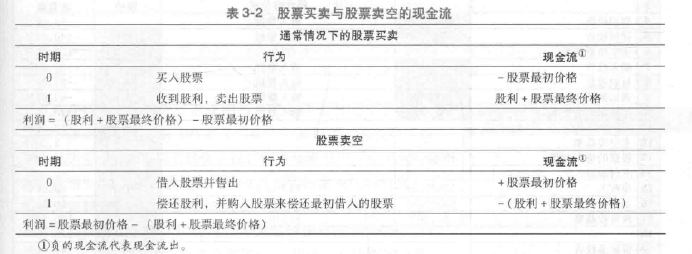
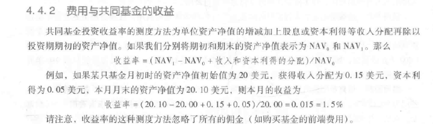
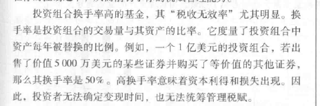
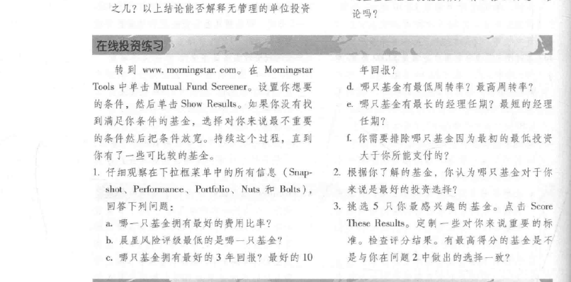
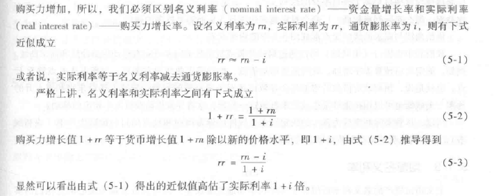
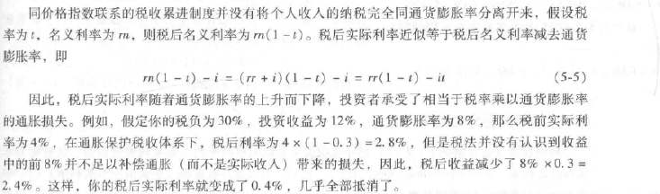
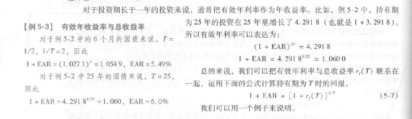

# 2. 资产类别与金融工具

### 2.1 货币市场

| 类别                      | xx                                                                                                                           |
| ------------------------- | ---------------------------------------------------------------------------------------------------------------------------- |
| 短期国库券                | 所有货币市场变现能力最强的。政府通过向公众出售国库券筹集资金                                                                 |
| 大额存单                  | 一种定期存款，流动性不强，可以出售给其他投资者                                                                               |
| 商业票据                  | 公司不直接向银行借钱，发行<b>短期无担保</b>债务票据。（2007年美国次级贷款违约） |
| 银行承兑汇票              | 类似于远期支票                                                                                                               |
| 欧洲美元                  | 国外银行以美元计价的存款（绝大多数数额大，存款期限短）                                                                       |
| 回购和逆回购              |                                                                                                                              |
| 联邦基金                  | 准备金账户中的资金（联邦基金率利率---货币政策松紧的度量指标）                                                                |
| 经济人拆借                |                                                                                                                              |
| 伦敦银行同业拆借市场LIBOR | 伦敦大型银行间的借款利率(<b>货币市场的关键基准利率</b>)                         |

## 2.2 债券市场

| 类别                                                               | xx                                                  |
| ------------------------------------------------------------------ | --------------------------------------------------- |
| 中长期国债                                                         |                                                     |
| 通胀保值债券                                                       | 本金需要更加消费者物价指数（CPI）的增幅按比例调整。 |
| 联邦机构债券                                                       |                                                     |
| 国际债券                                                           |                                                     |
| 市政债券（地方债？） |                                                     |
| 公司债券                                                           |                                                     |
| 抵押贷款和递延担保债券                                             |                                                     |

### 2.3 债券权益

## 3.证券是如何交易的

一级市场：投资银行推销

二级市场：投资者交易已发行证券的市场

### 私人控股公司

特点：

1. 不在公开市场交易
2. 不用定期公开营业状况等商业信息
3. 持股人少

私人控股公司可以通过直接向少数机构投资者或者高净值投资人群销售证券来募集必要的资金，私募

### 上市公司

特点：

1. 面向公众，可以在证券市场自由交易其股票
2. 首次公开发行（IPO）,增发
3. 由投资银行包销，投资银行赚取差价等

### 3.2 证券如何交易

| 市场的类型                                                                      |                  |
| ------------------------------------------------------------------------------- | ---------------- |
| 直接搜寻市场                                                                    | 买卖双方互相搜寻 |
| 经济人市场（ 一级市场 ）           | 类似于房地产市场 |
| ***交易商市场***     （二级市场） |                  |
| 拍卖市场（二级市场）              |                  |

**资金暗池**

> <b>不想让人知道子在执行大型的买入或卖出</b>

**保证金交易**

> <b>投资者从经纪人贷款买入</b>

85页

100-8---800

100-10--1000  -200

100-6--600  +200

## 4. 共同基金和其他投资公司

资产净值：每一股份的价值

> 投资公司的类型

| 类型         |                                                                                                                                               |
| ------------ | --------------------------------------------------------------------------------------------------------------------------------------------- |
| 单位投资信托 | 资金都投资在一个固定的投资组合中 会以资产净值+溢价出售                                                                                    |
| 投资管理公司 | 开放式基金：可以随时以资产净值赎回或发行基金股份（<b>共同基金</b>） 封闭式基金：和开发式相反 |
| 其他投资机构 | 综合基金 房地产投资信托 对冲基金：1。不受监管2.面向富有的投资人和机构3.投资时间限制长                                             |

### 4.1 共同基金

> 开放式投资公司被称为共同基金

> 共同基金的分类

> 共同基金的投资成本

运营费用,

前端费用(购买基金需要支付的佣金或者销售费用),

撤离费用

12b-:支付发行成本,需要每年支付

### 4.2 交易所交易基金(ETF)

共同基金的一种,追踪指数,可以按照股票一样运作指数投资组合

标准普尔\纳斯达克100\中证500

### 4.3 评价投资业绩的标准

# 资产组合理论和实践

## 5. 风险与收益入门及历史回顾

> 如何从现有的数据中"预测"期望收益和风险的历史水平

117

决定利率的基本因素：

1. 存款人的资金供给
2. 企业投资的净资金供给或资金需求
3. 政府

### 5.1 实际利率和名义利率

<b>消费者物价指数（CPI）:衡量对商品服务消费的平均价格水平</b>

<b>通货膨胀率：CPI的变化百分比，通货膨胀率上涨6%，说明你的货币购买力下降6%</b>

名义利率（资金增长率）

实际利率（购买力增长率）

实际利率 = 名义利率 - 通货膨胀率

<b>有效年利率（EAR）</b>

