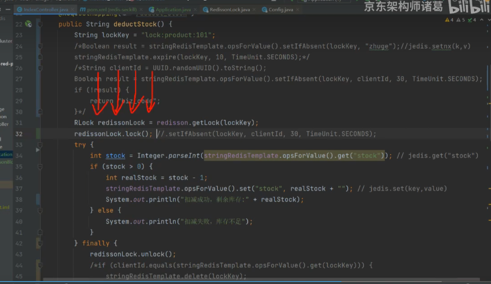
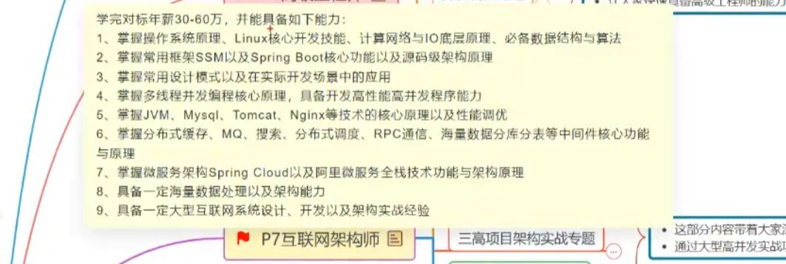
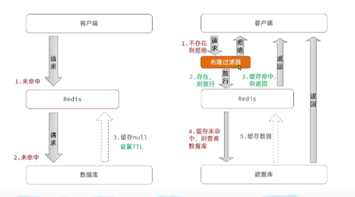
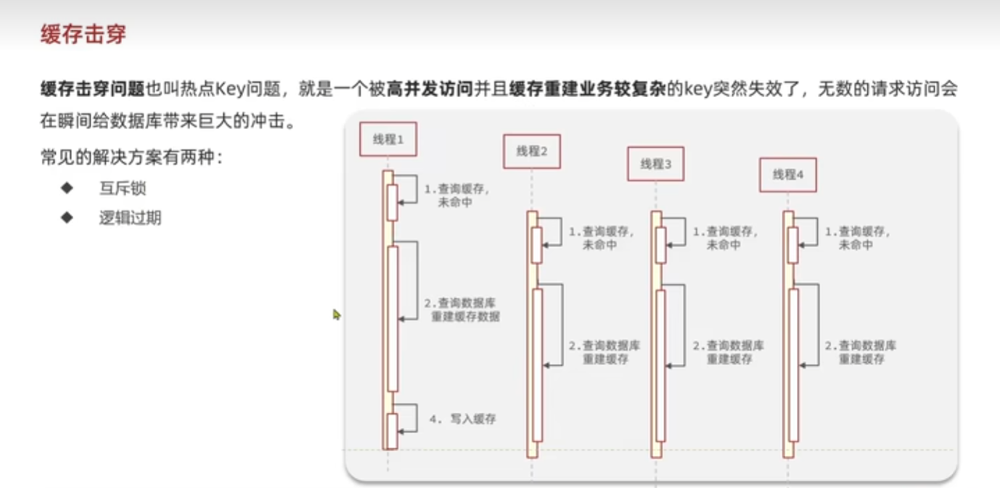
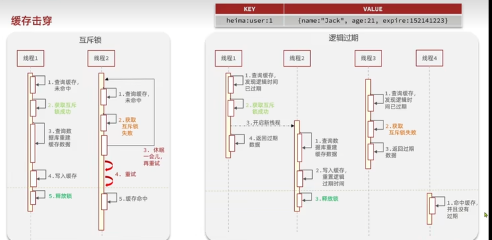
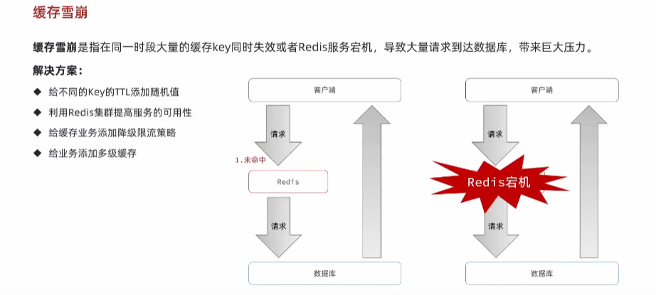

[		https://www.bilibili.com/video/BV1cr4y1671t?p=57&vd_source=106b27a8a05ed9f18f2e1c70d10383cb](https:/www.bilibili.com/video/BV1cr4y1671t?p=57&vd_source=106b27a8a05ed9f18f2e1c70d10383cb)

redis实战代码地址

[https://github.com/josiahcarlson](https:/github.com/josiahcarlson)

## 0.安装

- 官网：[https://redis.io](https://gitee.com/link?target=https%253A%252F%252Fredis.io)
- 中文网：[http://www.redis.net.cn/](https://gitee.com/link?target=http%253A%252F%252Fwww.redis.net.cn%252F)
- 教程: [https://blog.csdn.net/Wolf__king/article/details/129730768](https:/blog.csdn.net/Wolf__king/article/details/129730768)
- [https://blog.csdn.net/emprere/article/details/130757918](https:/blog.csdn.net/emprere/article/details/130757918)

1. 下载安装包解压

   ```cmd
   $ wget http://download.redis.io/releases/redis-5.0.4.tar.gz
   $ tar xzf redis-5.0.4.tar.gz
   $ cd redis-5.0.4
   $ make
   ```

   - 编译报错

     ```cmd
     /bin/sh: cc: command not found
     make[1]: *** [adlist.o] Error 127
     make[1]: Leaving directory `/approval/app/redis-5.0.4/src'
     make: *** [all] Error 2
     
     [root@localhost redis-5.0.4]# cd src/
     [root@localhost src]# make
         CC adlist.o
     In file included from adlist.c:34:0:
     zmalloc.h:50:31: fatal error: jemalloc/jemalloc.h: No such file or directory
      #include <jemalloc/jemalloc.h>
                                    ^
     compilation terminated.
     make: *** [adlist.o] Error 1
     ```

     > 解决：
     > 
     > 1. 安装gcc `yum install gcc`
     > 2. `make MALLOC=libc`


2. 修改配置(conf文件中的注释有详细说明 很棒)

   ```cmd
   $ vim redis.conf
   # 绑定的IP
   # bind 127.0.0.1
   # 密码认证
   requirepass root
   # 日志级别
   loglevel notice
   # log位置
   logfile "///"
   ```

3. 启动redis-server

   ```cmd
   /approval/app/redis-5.0.4/src/redis-server /approval/app/redis-5.0.4/src/redis.conf
   ```

4. 查询

   ```cmd
   # 没有密码
   /approval/app/redis-5.0.4/src/redis-cli
   # 有密码
   /approval/app/redis-5.0.4/src/redis-cli -h 127.0.0.1 -p 6379 -a root
   
   [root@localhost src]# ./redis-cli
   127.0.0.1:6379> auth root
   OK
   127.0.0.1:6379> keys *
   1) "6"
   ```

5. 退出

   ```cmd
   1. redis-cli shutdown
   2. redis-server--service-stop
   ```

6. 设置开机自启

```shell
[root@localhost system]# vim redis.service
[Unit]
Description=redis-server
After=network.target

[Service]
Type=forking
ExecStart=/approval/app/redis-5.0.4/src/redis-server /approval/app/redis-5.0.4/redis.conf
PrivateTmp=true

[Install]
WantedBy=muiti-user.target
[root@localhost system]# systemctl daemon-reload
[root@localhost system]# systemctl start redis
[root@localhost system]# systemctl status redis.service
● redis.service - redis-server
   Loaded: loaded (/etc/systemd/system/redis.service; disabled; vendor preset: disabled)
   Active: active (running) since Thu 2024-03-14 10:56:52 CST; 6s ago
  Process: 8071 ExecStart=/approval/app/redis-5.0.4/src/redis-server /approval/app/redis-5.0.4/redis.conf (code=exited, status=0/SUCCESS)
 Main PID: 8072 (redis-server)
    Tasks: 4
   CGroup: /system.slice/redis.service
           └─8072 /approval/app/redis-5.0.4/src/redis-server *:6379

Mar 14 10:56:52 localhost.localdomain systemd[1]: Starting redis-server...
Mar 14 10:56:52 localhost.localdomain systemd[1]: Started redis-server.
[root@localhost system]# systemctl enable redis

```

## 1.相关命令

### 1.1 **String**

```sql
127.0.0.1:6379> set hello tom
OK
127.0.0.1:6379> get hello
"tom"
```

### **1.2 List**

```sql
127.0.0.1:6379> rpush list item1
(integer) 1
127.0.0.1:6379> rpush list item2
(integer) 2
127.0.0.1:6379> rpush list item3
(integer) 3
127.0.0.1:6379> lrange list 0 -1
1) "item1"
2) "item2"
3) "item3"
127.0.0.1:6379> lindex list 2
"item3"
127.0.0.1:6379> lpop list
"item1"
127.0.0.1:6379> lrange list 0 -1
1) "item2"
2) "item3"

```

### **1.3 Hash**

```sql
127.0.0.1:6379> hset myhash car tesla
(integer) 1
127.0.0.1:6379> hset myhash bear weini
(integer) 1
127.0.0.1:6379> hset myhash car byd
(integer) 0
127.0.0.1:6379> hgetall myhas
(empty list or set)
127.0.0.1:6379> hgetall myhash
1) "car"
2) "byd"
3) "bear"
4) "weini"
127.0.0.1:6379> hget myhash car
"byd"
127.0.0.1:6379> hget myhash bear
"weini"
127.0.0.1:6379> hdel myhash car
(integer) 1
127.0.0.1:6379> hgetall myhash
1) "bear"
2) "weini"
127.0.0.1:6379>
```

### **1.4 Set**

```sql
127.0.0.1:6379> sadd myset item1
(integer) 1
127.0.0.1:6379> sadd myset item2
(integer) 1
127.0.0.1:6379> sadd myset item3
(integer) 1
127.0.0.1:6379>
127.0.0.1:6379>
127.0.0.1:6379> smembers myset
1) "item3"
2) "item1"
3) "item2"
127.0.0.1:6379> sismember myset item1
(integer) 1
127.0.0.1:6379> sismember myset item2
(integer) 1
127.0.0.1:6379>
127.0.0.1:6379> srem myset item2
(integer) 1
127.0.0.1:6379> smembers myset
1) "item3"
2) "item1"
127.0.0.1:6379>
```

### **1.5 Sorted Set**

```sql
127.0.0.1:6379> zadd myzset 100 tom
(integer) 1
127.0.0.1:6379> zadd myzset 200 finn
(integer) 1
127.0.0.1:6379> zadd myzset 300 bob
(integer) 1
127.0.0.1:6379> zrange myzset 0 -1 withscores
1) "tom"
2) "100"
3) "finn"
4) "200"
5) "bob"
6) "300"
127.0.0.1:6379> zrangebyscore myzset 0 200 withscores
1) "tom"
2) "100"
3) "finn"
4) "200"
127.0.0.1:6379> zrem myzset tom
(integer) 1
127.0.0.1:6379> zrange myzset 0 -1 withscores
1) "finn"
2) "200"
3) "bob"
4) "300"
127.0.0.1:6379>
```

### **1.6 Key**

```sql
127.0.0.1:6379> keys *
1) "myset"
2) "myzset"
3) "hello"
4) "list"
5) "6"
6) "myhash"
127.0.0.1:6379> keys myset
1) "myset"

```

### 1.7 其他

```sql
127.0.0.1:6379[1]> type votes
none
CLIENT LIST--查看当前使用的哪个DB
flushall--清除所有
FLUSHDB---清除当前DB
BGSAVE---创建一个快照不会阻塞其他命令，配置中的save选项就是执行的这个命令
SAVE---创建一个快照再快照完成前其他命令必须等待，服务关闭时会执行该命令进行持久化
```

BGSAVE会有额外的创建子进程的开销，SAVE会比BGSAVE快很多。可以通过在用户不多的情况下停止对redis的访问，然后执行SAVE命令。

1. 设置过期时间 `expire lock 5`
2. SETNX
3. 
4. 删除key `DEL key`
5. ETC

```sql
# 1. 切换DB 切换后会显示是哪个DB 没有的话就是0 DB数量在confg文件中配置
127.0.0.1:6379> select 2
OK
127.0.0.1:6379[2]> keys *
(empty list or set)
# 2. 显示DB信息
INFO
```

## 2.SpringBoot使用redis

```xml
<dependency>
            <groupId>org.springframework.boot</groupId>
            <artifactId>spring-boot-starter-data-redis</artifactId>
        </dependency>
```

```yaml
  redis:
    database: 1
    host: 192.168.1.150
    port: 6379
    password: root
```

jedis

redisson

springBoot-data-redis

## 3.数据备份持久化

### 3.1 快照

> 备份某个时间点的数据到文件

优点：二进制体积小

缺点：只能备份某个时间点的数据

- 配置

  ```shellsession
  # 从上次快照之后60s之内写入100000次 自动触发BGSAVE
  save 900 1 
  save 300 10
  save 60 10000
  stop-writes-on-bgsave-error yes
  rdbcompression yes 压缩
  rdbchecksum yes
  dbfilename dump.rdb #文件名
  dir ./ #文件位置
  ```

- 执行`SAVE`或者`BGSAVE`

  1. 从上次快照之后60s之内写入100000次 自动触发BGSAVE
  2. 主动执行save或者BGSAVE
  3. 服务shutdown的时候会执行save
  4. 和另外一台进行同步的时候,执行SYNC,主服务没有刚执行完BGSAVE的时候会执行BGSAVE

  ```sql
  127.0.0.1:6379> bgsave
  Background saving started
  127.0.0.1:6379> INFO persistence
  # Persistence
  loading:0
  rdb_changes_since_last_save:0
  rdb_bgsave_in_progress:0
  rdb_last_save_time:1710393003
  rdb_last_bgsave_status:ok
  rdb_last_bgsave_time_sec:0
  rdb_current_bgsave_time_sec:-1
  rdb_last_cow_size:290816
  aof_enabled:0
  aof_rewrite_in_progress:0
  aof_rewrite_scheduled:0
  aof_last_rewrite_time_sec:-1
  aof_current_rewrite_time_sec:-1
  aof_last_bgrewrite_status:ok
  aof_last_write_status:ok
  aof_last_cow_size:0
  
  ```

- 查看 `/approval/app/redis-5.0.4/backup/dump.rdb`
- 恢复 将服务停掉，将dump.rdb复制过去，启动后会自动读取该文件初始化数据库

### 3.2 AOF只追加文件

> 按照配置时间记录写入语句到文件中

优点：数据丢失少甚至不会丢失，读取恢复快

缺点：AOF文件可能会很大，可以通过BGREWRITEAOF命令去除冗余命令。删除较大的旧AOF文件同样会耗费较长的时间

- 配置

  <code><span style="color:rgba(244,63,94,1)">appendonly yes</span></code>

  ```shellsession
  appendonly yes
  appendfilename "appendonly.aof"
  appendfsync everysec
  no-appendfsync-on-rewrite no
  auto-aof-rewrite-percentage 100
  auto-aof-rewrite-min-size 64mb
  aof-load-truncated yes
  aof-use-rdb-preamble yes
  dir ./ #文件位置
  ```

- 执行

  根据配置中参数自动执行<code><span style="color:rgba(244,63,94,1)">appendfsync </span></code>

  always  -- 一直开启 不建议 太耗费性能

  on -- 系统决定 不好

  everysec --- 每秒一次，推荐

- 查看 `/approval/app/redis-5.0.4/backup/appendonly.aof`
- 恢复  将服务停掉，将appendonly.aof复制过去，启动后会自动读取该文件初始化数据库

### 3.3 复制

其实就是主从配置。

> 注意：在从服务器进行初始链接的时候会将自己的数据清除掉

1.通过配置slaveof host port将一个redis服务设置为从服务器

2.通过在redis服务上执行salveof命令来设置成从服务器


- 在初次全量同步过程中，Redis **只使用 RDB 快照** 来进行数据传输，而不会使用 AOF 文件。即使你启用了 AOF 持久化，AOF 文件也不会参与初次同步的过程。
- 部分重同步过程中，Redis **不依赖 AOF 或 RDB 文件**，而是通过复制积压缓冲区中的命令来进行同步。

保证高可用修改<code><span style="color:rgba(244,63,94,1)">redis.conf</span></code>

主从节点关闭`protected-mode no`

slave节点设置master节点的ip和端口以及密码认证`replicaof 192.168.* 6379` `masterauth root`

**注意：**

启动从节点时报错,将配置中的`dbcompression no`注释掉后启动成功

```console
Apr 09 22:50:25 localhost.localdomain redis-server[21583]: *** FATAL CONFIG FILE ERROR ***
Apr 09 22:50:25 localhost.localdomain redis-server[21583]: Reading the configuration file, at line 244
Apr 09 22:50:25 localhost.localdomain redis-server[21583]: >>> 'dbcompression no'
Apr 09 22:50:25 localhost.localdomain redis-server[21583]: Bad directive or wrong number of arguments
Apr 09 22:50:25 localhost.localdomain polkitd[795]: Unregistered Authentication Agent for unix-process:21575:166688 (system bus name :1.177, object path /org/freedesktop/PolicyKit1/AuthenticationAge
Apr 09 22:50:25 localhost.localdomain systemd[1]: redis.service: control process exited, code=exited status=1
Apr 09 22:50:25 localhost.localdomain systemd[1]: Failed to start redis-server.
```

## 4.集群

## 5.哨兵

哨兵模式比主从多了自动切换主节点的功能

基于主从模式

修改<code><span style="color:rgba(244,63,94,1)">sentinel.conf</span></code>

/approval/app/redis-5.0.4

/approval/app/redis-5.0.4/sentinel.log

/approval/app/redis-5.0.4/src/redis-cli -p 26379 INFO Sentinel

## 5.事务


## 6.常见问题

## 7.分布式锁

setnx用于加锁

```console
127.0.0.1:6379[1]> SETNX lock thread1
(integer) 1
127.0.0.1:6379[1]> expire lock 5
(integer) 1
127.0.0.1:6379[1]> ttl lock
(integer) 1
127.0.0.1:6379[1]> ttl lock
(integer) -2

```

```console
SET lock thread1 EX 10 NX
```


redisson

Lua脚本

redis分布式锁丢失如何解决

异步方法

同步方法



redlock

分段锁

防止重复提交



## 8. 缓存读写策略

- 原始策略：

  读redis--有返回

  ````
  --没有--读mysql--写入redis
  ````

- Cache-Aside。这是最常用的缓存策略，应用程序首先检查缓存，如果数据在缓存中，则直接返回给客户端；如果不在，则从数据库中读取数据，并将数据存储在缓存中，然后返回给客户端。这种方式特别适合读多写少的场景，并且在缓存故障时，系统仍然可以通过直接访问数据库进行操作

  ````
  --读取--读缓存--有--返回
               --没有--读数据库--存入缓存--返回给用户
  --写入--读数据库--删除缓存
  ````

- Read/Write Through。在这种策略下，缓存服务负责数据同步的工作。当发生数据读取时，缓存会检查数据是否在缓存中，如果在，则直接返回；如果不存在，则从数据库中读取数据，并更新缓存。当发生数据写入时，缓存同样会检查数据是否在缓存中，如果在，则更新缓存；如果不存在，则直接写入数据库，并更新缓存。
- Write Behind。在这种策略下，缓存的更新请求会被入队，并定期刷新到数据存储中，如数据库。这种方式适用于对强一致性要求不高的场景，因为它允许异步更新缓存和数据存储

[https://www.cnblogs.com/reim/p/17414244.html](https:/www.cnblogs.com/reim/p/1)


百度使用Redis的读写策略可能涉及到多种情况，因为具体的策略可能会根据业务场景、性能需求、数据一致性要求等因素进行选择和调整。以下是几种常见的Redis读写策略，以及它们可能的应用场景：

1. **Cache Aside Pattern（旁路缓存模式）**：

   - 读取时，应用首先检查缓存中是否有数据，如果有则直接返回；如果没有则从数据库中读取数据，并将数据放入缓存中。
   - 写入时，应用首先更新数据库，然后再删除缓存中的对应数据（或者采用延时双删策略确保数据一致性）。
   - 适用于读多写少的场景，能减少数据库的读压力，并通过删除缓存而不是更新缓存来避免缓存和数据库之间的数据不一致问题。

2. **Read/Write Through Pattern（读写穿透模式）**：

   - 应用的所有读写操作都通过缓存层进行，缓存层负责数据的读写和与数据库的同步。
   - 适用于对一致性要求较高的场景，因为所有数据操作都经过缓存层，可以确保数据的一致性。但可能会增加缓存层的复杂性和性能开销。

3. **Write Behind Pattern（异步缓存写入模式）**：

   - 写操作发生时，数据首先写入缓存，然后异步地将数据写入数据库。
   - 这种模式能减少写操作的延迟，提高性能，但可能增加数据丢失的风险（如缓存故障或异步写入失败）。


百度作为一个大型互联网公司，其业务场景复杂多样，可能会根据具体业务需求和性能考虑选择或结合使用上述策略。同时，百度可能还有自己的一些定制化或优化过的Redis读写策略，以适应其特定的业务和技术架构。

需要注意的是，具体的Redis读写策略应该根据实际应用场景和需求进行选择和调整，并需要结合数据库一致性、性能、可扩展性等多个方面进行综合考虑。


在阿里巴巴这样的大型企业环境中，Redis的读写策略通常会结合业务需求、系统架构以及性能要求进行精细化设计和实现。以下是几种可能在阿里巴巴场景下使用的Redis读写策略，以及对应的流程图描述：

### 1. 旁路缓存策略（Cache-Aside Pattern）

#### 读写策略

- **读操作**：应用程序首先查询Redis缓存。如果缓存命中，则直接返回数据；如果缓存未命中，则从数据库读取数据，并将数据写入Redis缓存，以便后续的读操作可以快速从缓存中获取。
- **写操作**：应用程序首先更新数据库，然后删除或更新Redis中对应的数据。这种策略允许数据库和缓存之间存在短暂的不一致性，但通常这种不一致性对业务影响较小。

#### 流程图

1. **读操作**：

   - 应用程序发送读请求到Redis。
   - Redis检查缓存中是否有数据。
   - 如果缓存命中，返回数据给应用程序。
   - 如果缓存未命中，应用程序从数据库读取数据。
   - 应用程序将读取到的数据写入Redis缓存。
   - 应用程序返回数据给调用方。

2. **写操作**：

   - 应用程序更新数据库中的数据。
   - 应用程序根据策略删除或更新Redis中的缓存数据（可以选择立即更新或设置一个较短的过期时间）。


### 2. 读写穿透策略（Read/Write Through Pattern）

#### 读写策略

- **读操作**：应用程序只与Redis交互，如果Redis中没有数据，Redis会负责从数据库中同步数据并更新到缓存中。
- **写操作**：应用程序同样只与Redis交互，Redis负责将数据同步到数据库中，并保持缓存与数据库的一致性。

#### 流程图

1. **读操作**：

   - 应用程序发送读请求到Redis。
   - Redis检查缓存中是否有数据。
   - 如果缓存命中，返回数据给应用程序。
   - 如果缓存未命中，Redis从数据库中读取数据。
   - Redis将读取到的数据写入缓存。
   - Redis返回数据给应用程序。

2. **写操作**：

   - 应用程序发送写请求到Redis。
   - Redis更新缓存中的数据。
   - Redis将更新的数据同步到数据库中。


### 3. 异步缓存写入策略（Write Behind Pattern）

#### 读写策略

- **读操作**：与旁路缓存策略类似，应用程序首先查询Redis缓存。
- **写操作**：应用程序只更新Redis缓存，Redis异步地将数据写入数据库。这种方式可以提高写操作的性能，但可能增加数据不一致性的风险。

#### 流程图

1. **读操作**（与旁路缓存策略相同）。
2. **写操作**：

   - 应用程序发送写请求到Redis。
   - Redis更新缓存中的数据。
   - Redis异步地将更新的数据写入数据库。


### 注意事项

- 在实际应用中，阿里巴巴可能会根据具体的业务场景、数据一致性要求、性能需求等因素，对上述策略进行微调或组合使用。
- 阿里巴巴通常会有完善的监控和告警机制，以确保Redis缓存和数据库之间的数据一致性，并在出现问题时及时进行处理。
- 阿里巴巴可能还会使用其他高级特性，如Redis集群、分布式锁等，来进一步提高系统的可用性和性能。

由于具体的读写策略和流程图可能因阿里巴巴的内部实现和业务需求而有所不同，上述内容仅提供了一种可能的思路和方向。在实际应用中，建议参考阿里巴巴的官方文档或相关技术资料，以获取更准确和详细的信息。

## 9. 缓存穿透

现象：缓存层失效导致大量请求全部到mysql

原因：业务问题导致缓存删除，大量接口访问了不在缓存中的数据

解决方案：分布式锁、缓存不过期，限流、校验、<b><span style="color:rgba(244,63,94,1)">布隆过滤器</span></b>、即使不在数据库中的数据也进行缓存并设置有效期



## 10.缓存击穿

hotkey的访问导致redis崩掉





## 10. 缓存雪崩

现象：缓存中大量数据同时失效导致大量请求全部到mysql，

原因：redis宕机，缓存中大量数据同时失效

解决方案：分布式锁、缓存不过期

[https://blog.csdn.net/ll945608651/article/details/130740221](https:/blog.csdn.net/ll945608651/article/details/130740221)




## 13. Redison

[https://blog.csdn.net/A_art_xiang/article/details/125525864](https:/blog.csdn.net/A_art_xiang/article/details/125525864)

````
<update id="updateStateByNumbering" parameterType="String">
  update asset_form
  set 
      state = #{state,jdbcType=BIT}
  where numbering = #{id,jdbcType=BIGINT}
</update>

<select id="selectByNumbering" parameterType="java.lang.String" resultMap="BaseResultMap">
  select
  <include refid="Base_Column_List" />
  from asset_form
  where numbering = #{numbering,jdbcType=VARCHAR}
</select>
````

上一份工作Redis使用

1.场景

1.1 业务中主要只是对redis中数据的读取，基本上不做设置

1.2 数据更新分为一小时 一天

1.3 数据推送应该是经过auto handler、data receiver进行处理

1.4 根据请求的分为三类读取

对于String直接更新 对于List删除后插入

频率不高

读取缓存 有则读取缓存 没有则读取数据库 设置缓存返回

> 这里如何保证其他的session不会再去创建相同的缓存呢？

| redis                                                 | session1  | session2  | session3  |
| ----------------------------------------------------- | --------- | --------- | --------- |
| {data:null,refuseh:null,data-key:key1,curDate:owner:} | 查询没有  |           |           |
|                                                       | 创建      |           |           |
|                                                       | 设置owner | 等待200ms | 等待200ms |
|                                                       |           |           |           |
|                                                       |           |           |           |
|                                                       |           |           |           |
|                                                       |           |           |           |
|                                                       |           |           |           |

jedis

redis cluster