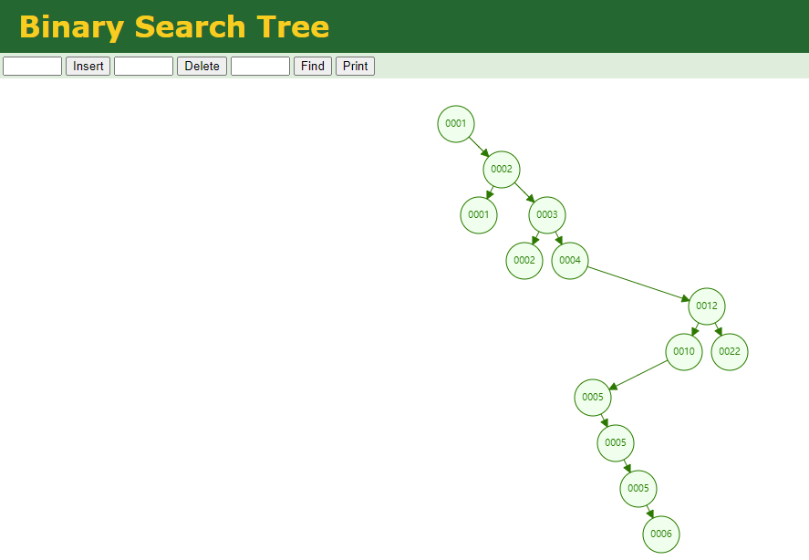
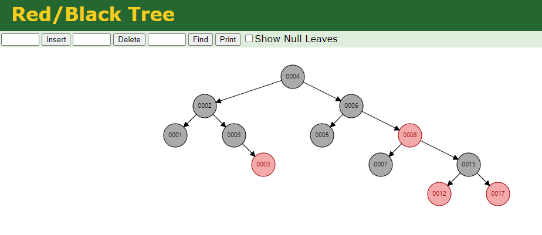
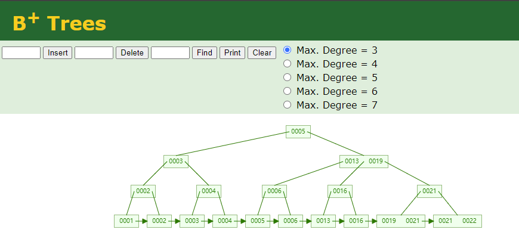
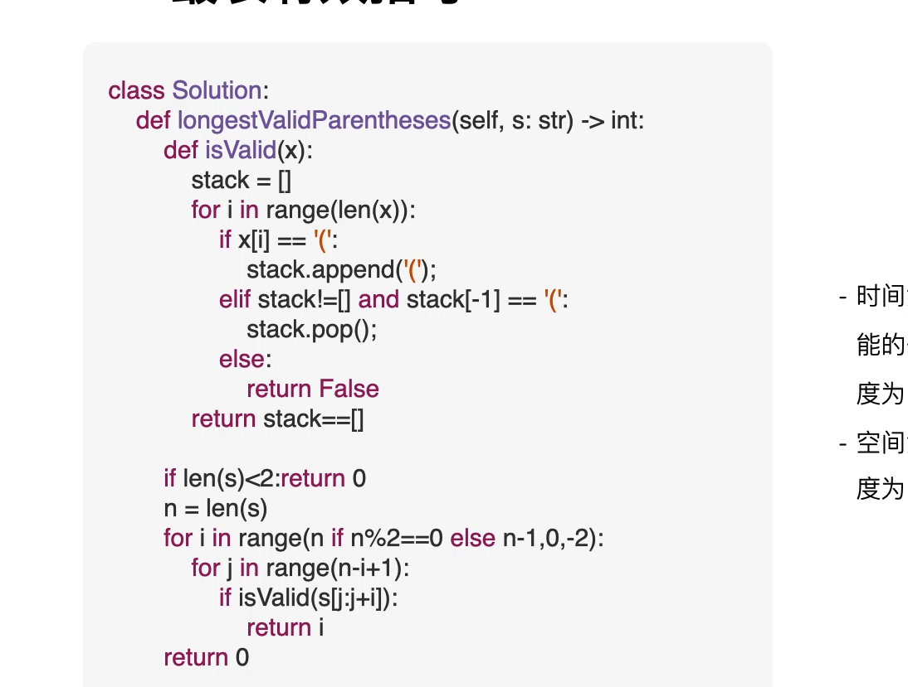

# 图

无向图

有向图

加权图

加权有向图

顶点：vertex 边：edge

特殊的图：自环和平行边

深度优先DFS

广度优先BFS

## 树

二叉树

二叉搜索树

平衡树

红黑树

B树

B+树

状态

状态转移方程

15829247313

## 贪心

### 原理

‧ 贪心选择性质：只有当局部最优选择始终可以导致全局最优解时，贪心算法才能保证得到最优解。  
‧ 最优子结构：原问题的最优解包含子问题的最优解。

### 步骤

1. 问题分析：梳理与理解问题特性，包括状态定义、优化目标和约束条件等。这一步在回溯和动态规划中  
都有涉及。  
2. 确定贪心策略：确定如何在每一步中做出贪心选择。这个策略能够在每一步减小问题的规模，并最终解  
决整个问题。  
3. 正确性证明：通常需要证明问题具有贪心选择性质和最优子结构。这个步骤可能需要用到数学证明，例  
如归纳法或反证法等。

### 相关问题

‧ 硬币找零问题：在某些硬币组合下，贪心算法总是可以得到最优解。  
‧ 区间调度问题：假设你有一些任务，每个任务在一段时间内进行，你的目标是完成尽可能多的任务。如  
果每次都选择结束时间最早的任务，那么贪心算法就可以得到最优解。  
‧ 分数背包问题：给定一组物品和一个载重量，你的目标是选择一组物品，使得总重量不超过载重量，且  
总价值最大。如果每次都选择性价比最高（价值 / 重量）的物品，那么贪心算法在一些情况下可以得到  
最优解。  
‧ 股票买卖问题：给定一组股票的历史价格，你可以进行多次买卖，但如果你已经持有股票，那么在卖出  
之前不能再买，目标是获取最大利润。  
‧ 霍夫曼编码：霍夫曼编码是一种用于无损数据压缩的贪心算法。通过构建霍夫曼树，每次选择出现频率  
最低的两个节点合并，最后得到的霍夫曼树的带权路径长度（编码长度）最小。  
‧ Dijkstra 算法：它是一种解决给定源顶点到其余各顶点的最短路径问题的贪心算法。