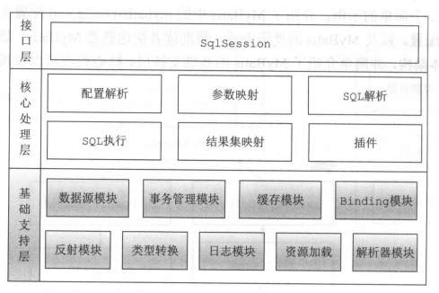
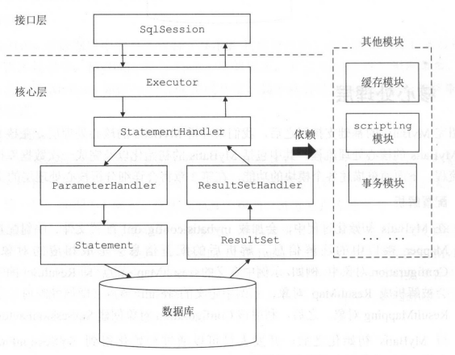

> 官方文档：[https://mybatis.org/](https:/mybatis.org/)
> 
> 书籍:

## 1.模块





## 2.初始化流程

## 3.执行流程

扫描mapper以及对应的xml解析存入configuration中

|

|

MapperMethod-->具体mapper方法执行

MapperProxy-->mapper代理实例

MapperProxyFactory-->生成mapper的代理对象的实例

MapperRegistry-->存放扫描到的mapper数据

|

|

sqlsession中使用execute进行执行


## 4.主要的默认配置

## 5.核心模块

### 5.1 plugin

> 1.通过责任链模式进行解耦
> 
> 2.使用拦截器

主要由以下类组成

Interceptor接口

InterceptorChain

Invocation

Plugin

＠Intercepts

＠Signature (type\method\args)

### 5.2 cache


## 6. 设计模式

> 

### 6.1工厂模式

### 6.2策略模式

### 6.3责任链

### 6.4代理模式

### 6.5装饰模式

# 几个问题

- 何时加载配置

  ````
  RepositoryConfigurationDelegate
  DefaultListableBeanFactory---> create MapperScannerConfigurer Bean
  org.apache.ibatis.logging.LogFactory     
  ClassPathMapperScanner
  ````

- 何时读取mapper修饰接口
- xml何时读取
- 执行dao时如何从mapper到指定sql执行返回
- 事务情况
- 缓存时程序如何执行

[mybatis3.3.0源码注释与架构分析](https://github.com/nero520/mybatis/commit/5d9f671c0c561c957c0fc329775ef343f902a1d3)

[https://github.com/nero520/mybatis/tree/master/search-mybatis-mybatis/doc](https:/github.com/nero520/mybatis/tree/master/search-mybatis-mybatis/doc)

开启log

```yaml
mybatis:
  mapper-locations: classpath:mapper/*.xml
  configuration:
    log-impl: org.apache.ibatis.logging.stdout.StdOutImpl
```

开启一级缓存

sqlsession级别 默认开启

开启二级缓存

```yaml
mybatis:
  mapper-locations: classpath:mapper/*.xml
  configuration:
    log-impl: org.apache.ibatis.logging.stdout.StdOutImpl
    cache-enabled: true
```

代码生成

1. 引入POM

   ```xml
   <dependency>
           <groupId>org.mybatis.generator</groupId>
           <artifactId>mybatis-generator-core</artifactId>
           <version>1.4.0</version>
   </dependency>
   <plugins>
           <plugin>
               <groupId>org.mybatis.generator</groupId>
               <artifactId>mybatis-generator-maven-plugin</artifactId>
               <version>1.4.0</version>
               <dependencies>
                   <!-- 这里可以添加插件运行时需要的额外依赖 -->
               </dependencies>
               <configuration>
                   <!-- 配置文件的位置 -->
                   <configurationFile>src/main/resources/config/mybatis-generator.xml</configurationFile>
                   <overwrite>true</overwrite>
                   <verbose>true</verbose>
               </configuration>
               <executions>
                   <execution>
                       <goals>
                           <goal>generate</goal>
                           </goals>
                       </execution>
                   </executions>
               </plugin>
   ```

2. 创建配置文件

   ```xml
   <?xml version="1.0" encoding="UTF-8"?>
   <!DOCTYPE generatorConfiguration
           PUBLIC "-//mybatis.org//DTD MyBatis Generator Configuration 1.0//EN"
           "http://mybatis.org/dtd/mybatis-generator-config_1_0.dtd">
   <generatorConfiguration>
       <!--mysql 连接数据库jar 这里选择自己本地位置-->
       <classPathEntry
               location="D:\myWorkSpace\develop\mavenlocalRep\mysql\mysql-connector-java\8.0.28\mysql-connector-java-8.0.28.jar"/>
       <context id="btmovieTables" targetRuntime="MyBatis3">
           <commentGenerator>
               <!-- 是否去除自动生成的注释 true：是 ： false:否 -->
               <property name="suppressAllComments" value="true"/>
           </commentGenerator>
           <!--数据库连接的信息：驱动类、连接地址、用户名、密码 -->
           <jdbcConnection driverClass="com.mysql.jdbc.Driver"
                           connectionURL="jdbc:mysql://localhost:3306/btmovie?useUnicode=true&amp;characterEncoding=utf8&amp;useSSL=false&amp;serverTimezone=GMT%2B8&amp;allowPublicKeyRetrieval=true" userId="root"
                           password="root">
           </jdbcConnection>
           <!-- 默认false，把JDBC DECIMAL 和 NUMERIC 类型解析为 Integer，为 true时把JDBC DECIMAL 和
              NUMERIC 类型解析为java.math.BigDecimal -->
           <javaTypeResolver>
               <property name="forceBigDecimals" value="false"/>
           </javaTypeResolver>
   
           <!-- targetProject:生成PO类的位置 -->
           <javaModelGenerator targetPackage="com.hello.module"
                               targetProject="src/main/java">
               <!-- enableSubPackages:是否让schema作为包的后缀 -->
               <property name="enableSubPackages" value="false"/>
               <!-- 从数据库返回的值被清理前后的空格 -->
               <property name="trimStrings" value="true"/>
           </javaModelGenerator>
           <!-- targetProject:mapper映射文件生成的位置
              如果maven工程只是单独的一个工程，targetProject="src/main/java"
              若果maven工程是分模块的工程，targetProject="所属模块的名称"，例如：
              targetProject="ecps-manager-mapper"，下同-->
           <sqlMapGenerator targetPackage="mapper"
                            targetProject="src/main/resources">
               <!-- enableSubPackages:是否让schema作为包的后缀 -->
               <property name="enableSubPackages" value="false"/>
           </sqlMapGenerator>
           <!-- targetPackage：mapper接口生成的位置 -->
           <javaClientGenerator type="XMLMAPPER"
                                targetPackage="com.hello.mapper"
                                targetProject="src/main/java">
               <!-- enableSubPackages:是否让schema作为包的后缀 -->
               <property name="enableSubPackages" value="false"/>
           </javaClientGenerator>
           <!-- 指定数据库表  多个表示,可用多个table标签-->
           <table tableName="device" domainObjectName="Device" enableCountByExample="false" enableDeleteByExample="false" enableSelectByExample="false" enableUpdateByExample="false">
               <generatedKey column="id" sqlStatement="MYSQL"/>
           </table>
           <table tableName="order" domainObjectName="Order" enableCountByExample="false" enableDeleteByExample="false" enableSelectByExample="false" enableUpdateByExample="false">
               <generatedKey column="id" sqlStatement="MYSQL"/>
           </table>
           <table tableName="order_history" domainObjectName="OrderHistory" enableCountByExample="false" enableDeleteByExample="false" enableSelectByExample="false" enableUpdateByExample="false">
               <generatedKey column="id" sqlStatement="MYSQL"/>
           </table>
           <table tableName="stack" domainObjectName="Stack" enableCountByExample="false" enableDeleteByExample="false" enableSelectByExample="false" enableUpdateByExample="false">
               <generatedKey column="id" sqlStatement="MYSQL"/>
           </table>
       </context>
   </generatorConfiguration>
   ```

3. 

一对多 resultMap中使用collection 或者嵌套查询 select

foreach if when choose where

[https://blog.csdn.net/sxzdkfjr/article/details/134362219](https:/blog.csdn.net/sxzdkfjr/article/details/134362219)


## 源码

### 1. 模块

```console
└─src
    ├─main
    │  └─java
    │      └─org
    │          └─apache
    │              └─ibatis
    │                  ├─annotations
    │                  ├─binding
    │                  ├─builder
    │                  │  ├─annotation
    │                  │  └─xml
    │                  ├─cache
    │                  │  ├─decorators
    │                  │  └─impl
    │                  ├─datasource
    │                  │  ├─jndi
    │                  │  ├─pooled
    │                  │  └─unpooled
    │                  ├─exceptions
    │                  ├─executor
    │                  │  ├─keygen
    │                  │  ├─loader
    │                  │  │  ├─cglib
    │                  │  │  └─javassist
    │                  │  ├─parameter
    │                  │  ├─result
    │                  │  ├─resultset
    │                  │  └─statement
    │                  ├─io
    │                  ├─jdbc
    │                  ├─logging
    │                  │  ├─commons
    │                  │  ├─jdbc
    │                  │  ├─jdk14
    │                  │  ├─log4j
    │                  │  ├─log4j2
    │                  │  ├─nologging
    │                  │  ├─slf4j
    │                  │  └─stdout
    │                  ├─mapping
    │                  ├─parsing
    │                  ├─plugin
    │                  ├─reflection
    │                  │  ├─factory
    │                  │  ├─invoker
    │                  │  ├─property
    │                  │  └─wrapper
    │                  ├─scripting
    │                  │  ├─defaults
    │                  │  └─xmltags
    │                  ├─session
    │                  │  └─defaults
    │                  ├─transaction
    │                  │  ├─jdbc
    │                  │  └─managed
    │                  └─type
```


### 2. 主要模块功能

Configuration.class

> 保存了各种配置属性

```java
protected Environment environment;
    protected boolean safeRowBoundsEnabled;
    protected boolean safeResultHandlerEnabled;
    protected boolean mapUnderscoreToCamelCase;
    protected boolean aggressiveLazyLoading;
    protected boolean multipleResultSetsEnabled;
    protected boolean useGeneratedKeys;
    protected boolean useColumnLabel;
    protected boolean cacheEnabled;
    protected boolean callSettersOnNulls;
    protected boolean useActualParamName;
    protected boolean returnInstanceForEmptyRow;
    protected boolean shrinkWhitespacesInSql;
    protected boolean nullableOnForEach;
    protected boolean argNameBasedConstructorAutoMapping;
    protected String logPrefix;
    protected Class<? extends Log> logImpl;
    protected Class<? extends VFS> vfsImpl;//和Jboss相关
    protected Class<?> defaultSqlProviderType;
    protected LocalCacheScope localCacheScope;// SESSION\STATEMENT
    protected JdbcType jdbcTypeForNull;
    protected Set<String> lazyLoadTriggerMethods;
    protected Integer defaultStatementTimeout;
    protected Integer defaultFetchSize;
    protected ResultSetType defaultResultSetType;
    protected ExecutorType defaultExecutorType;
    protected AutoMappingBehavior autoMappingBehavior;
    protected AutoMappingUnknownColumnBehavior autoMappingUnknownColumnBehavior;
    protected Properties variables;
    protected ReflectorFactory reflectorFactory;
    protected ObjectFactory objectFactory;
    protected ObjectWrapperFactory objectWrapperFactory;
    protected boolean lazyLoadingEnabled;
    protected ProxyFactory proxyFactory;
    protected String databaseId;
    protected Class<?> configurationFactory;
    protected final MapperRegistry mapperRegistry;
    protected final InterceptorChain interceptorChain;// 
    protected final TypeHandlerRegistry typeHandlerRegistry;
    protected final TypeAliasRegistry typeAliasRegistry;
    protected final LanguageDriverRegistry languageRegistry;
    protected final Map<String, MappedStatement> mappedStatements;
    protected final Map<String, Cache> caches;
    protected final Map<String, ResultMap> resultMaps;
    protected final Map<String, ParameterMap> parameterMaps;
    protected final Map<String, KeyGenerator> keyGenerators;
    protected final Set<String> loadedResources;
    protected final Map<String, XNode> sqlFragments;
    protected final Collection<XMLStatementBuilder> incompleteStatements;
    protected final Collection<CacheRefResolver> incompleteCacheRefs;
    protected final Collection<ResultMapResolver> incompleteResultMaps;
    protected final Collection<MethodResolver> incompleteMethods;
    protected final Map<String, String> cacheRefMap;
```