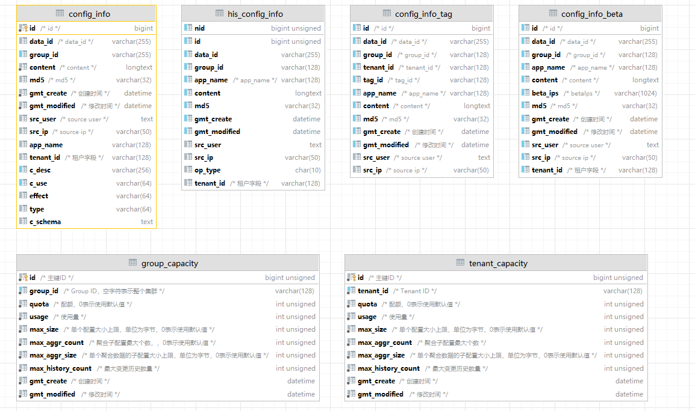
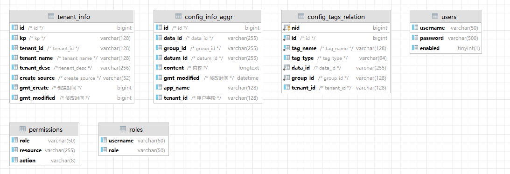

# Nacos的服务启动（单机和集群）
## 单机启动
执行bin目录下的startup.sh/bat -m standalone
## 集群
修改配置文件config/application.properties

# Nacos服务注册和发现

# Nacos配置中心
## 如何读取配置
在官方给出的example中有几种方式
1. 注解注入到类的属性中
2. 

## 表结构

## 请求入参处理

## 权限注解校验

## 心跳

## 全局异常处理

## AOP

## 自定义注解

## 接口返回数据结构

## log的打印

## 异常的处理
