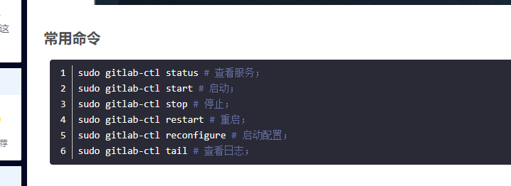

[https://mp.weixin.qq.com/s/ZQ6woHimkhjzD3hpw7A7nA](https:/mp.weixin.qq.com/s/ZQ6woHimkhjzD3hpw7A7nA)


[https://blog.csdn.net/qq_25231683/article/details/132537302](https:/blog.csdn.net/qq_25231683/article/details/132537302)

````
[root@k8s-node1 ~]# gitlab-ctl restart
fail: alertmanager: runsv not running
fail: gitaly: runsv not running
fail: gitlab-exporter: runsv not running
fail: gitlab-workhorse: runsv not running
fail: grafana: runsv not running
fail: logrotate: runsv not running
fail: nginx: runsv not running
fail: node-exporter: runsv not running
fail: postgres-exporter: runsv not running
fail: postgresql: runsv not running
fail: prometheus: runsv not running
fail: redis: runsv not running
fail: redis-exporter: runsv not running
fail: sidekiq: runsv not running
fail: unicorn: runsv not running

````

````
[root@k8s-node1 ~]# sudo systemctl start gitlab-runsvdir
You have new mail in /var/spool/mail/root
[root@k8s-node1 ~]# sudo gitlab-ctl restart

````

