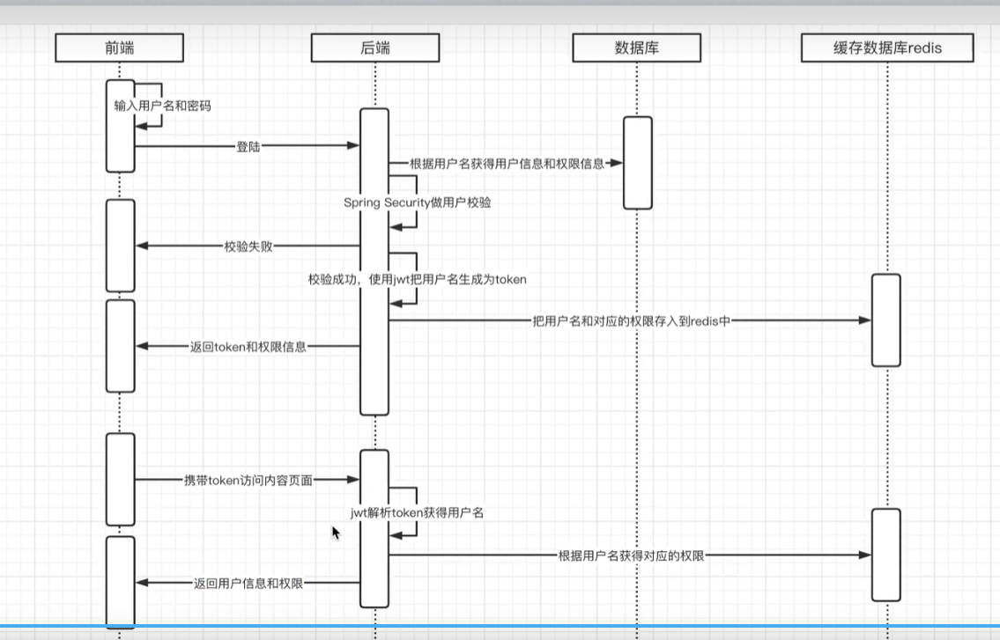
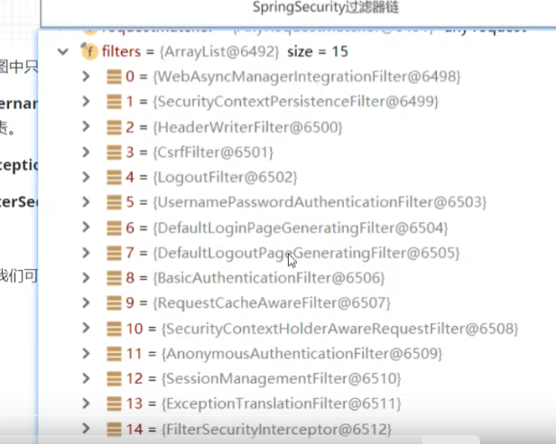
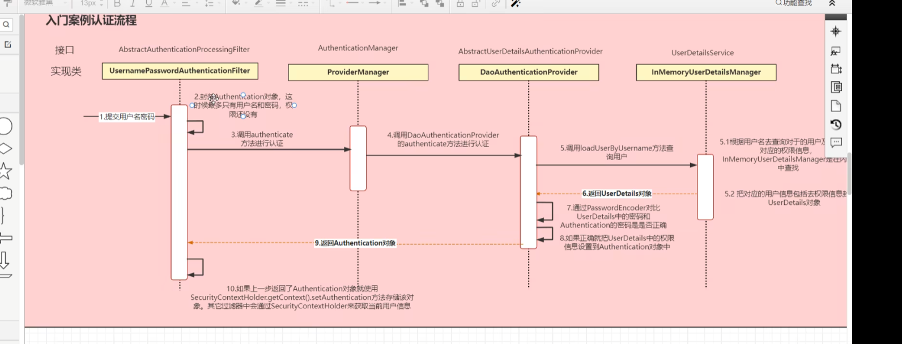
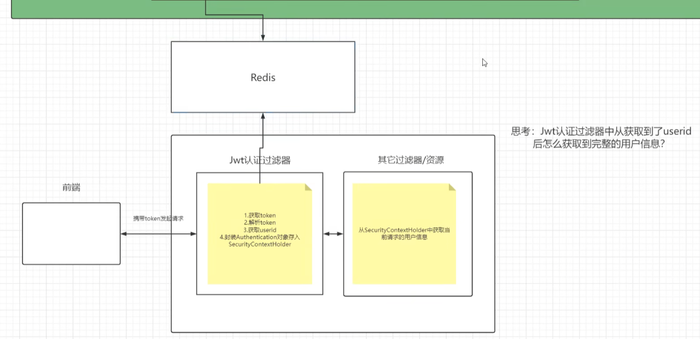
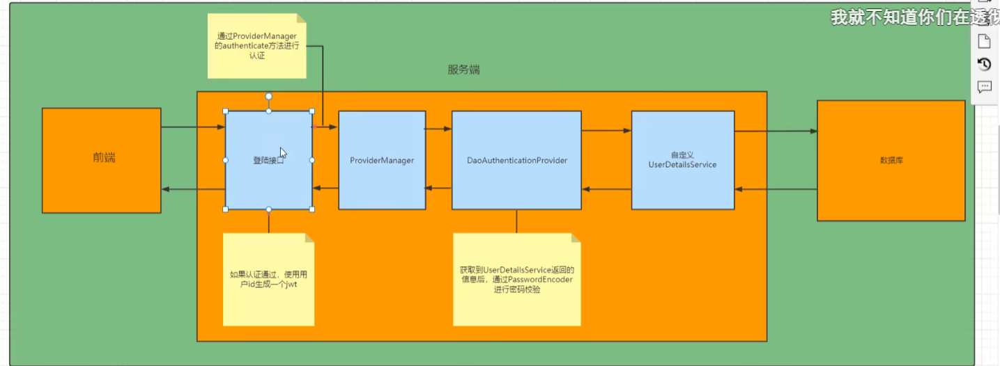
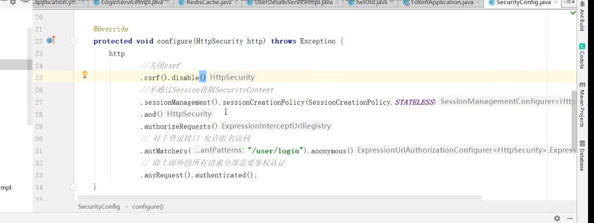

@EnableGlobalMethodSecurity和@EnableSecurity在Spring Security框架中各自扮演不同的角色，具有不同的功能和用途。

@EnableGlobalMethodSecurity是Spring Security框架中的一个注解，用于启用全局方法级别的安全配置。这个注解允许开发者在方法上使用特定的注解（如@PreAuthorize、@PostAuthorize等）来定义安全规则。这些注解会在方法调用前后执行权限检查，确保只有满足特定条件的用户才能调用这些方法。该注解适用于需要在方法级别进行细粒度安全控制的场景，例如在业务逻辑中，某些敏感操作（如修改用户信息、删除订单等）可能只允许具有特定角色或权限的用户执行。此外，它还会配置一个全局的AuthenticationManager，用于管理用户的认证过程。

然而，关于@EnableSecurity这个注解，目前在Spring Security的官方文档和常见资料中并没有明确的描述。可能是因为它并非Spring Security框架中的一个标准注解，或者是一个特定项目、库或框架中自定义的注解。在缺乏具体上下文的情况下，无法准确解释@EnableSecurity的功能和用途。

总的来说，@EnableGlobalMethodSecurity是Spring Security框架中用于启用全局方法级别安全配置的注解，而@EnableSecurity可能是一个特定上下文中的自定义注解，其功能和用途需要根据具体项目或框架来确定。因此，在使用这两个注解时，建议查阅相关文档或参考项目代码以了解其确切含义和用法。




## 表

```sql
create database user;
use user;
CREATE TABLE `users` (
                         `id` INT(11) UNSIGNED NOT NULL AUTO_INCREMENT,
                         `username` VARCHAR(255) NOT NULL,
                         `password` VARCHAR(255) NOT NULL, -- 存储密码的哈希值
                         `email` VARCHAR(255) NOT NULL,
                         `phone` VARCHAR(20) DEFAULT NULL,
                         `created_at` TIMESTAMP DEFAULT CURRENT_TIMESTAMP,
                         `updated_at` TIMESTAMP DEFAULT CURRENT_TIMESTAMP ON UPDATE CURRENT_TIMESTAMP,
                         PRIMARY KEY (`id`),
                         UNIQUE KEY `idx_username` (`username`),
                         UNIQUE KEY `idx_email` (`email`)
) ENGINE=InnoDB DEFAULT CHARSET=utf8mb4;

CREATE TABLE `roles` (
                         `id` INT(11) UNSIGNED NOT NULL AUTO_INCREMENT,
                         `name` VARCHAR(50) NOT NULL,
                         `description` TEXT DEFAULT NULL,
                         `created_at` TIMESTAMP DEFAULT CURRENT_TIMESTAMP,
                         `updated_at` TIMESTAMP DEFAULT CURRENT_TIMESTAMP ON UPDATE CURRENT_TIMESTAMP,
                         PRIMARY KEY (`id`),
                         UNIQUE KEY `idx_name` (`name`)
) ENGINE=InnoDB DEFAULT CHARSET=utf8mb4;

CREATE TABLE `user_roles` (
                              `id` INT(11) UNSIGNED NOT NULL AUTO_INCREMENT,
                              `user_id` INT(11) UNSIGNED NOT NULL,
                              `role_id` INT(11) UNSIGNED NOT NULL,
                              `created_at` TIMESTAMP DEFAULT CURRENT_TIMESTAMP,
                              PRIMARY KEY (`id`),
                              UNIQUE KEY `idx_unique_user_role` (`user_id`, `role_id`),
                              FOREIGN KEY (`user_id`) REFERENCES `users` (`id`) ON DELETE CASCADE,
                              FOREIGN KEY (`role_id`) REFERENCES `roles` (`id`) ON DELETE CASCADE
) ENGINE=InnoDB DEFAULT CHARSET=utf8mb4;

CREATE TABLE `permissions` (
                               `id` INT(11) UNSIGNED NOT NULL AUTO_INCREMENT,
                               `name` VARCHAR(50) NOT NULL,
                               `description` TEXT DEFAULT NULL,
                               `created_at` TIMESTAMP DEFAULT CURRENT_TIMESTAMP,
                               `updated_at` TIMESTAMP DEFAULT CURRENT_TIMESTAMP ON UPDATE CURRENT_TIMESTAMP,
                               PRIMARY KEY (`id`),
                               UNIQUE KEY `idx_name` (`name`)
) ENGINE=InnoDB DEFAULT CHARSET=utf8mb4;

CREATE TABLE `role_permissions` (
                                    `id` INT(11) UNSIGNED NOT NULL AUTO_INCREMENT,
                                    `role_id` INT(11) UNSIGNED NOT NULL,
                                    `permission_id` INT(11) UNSIGNED NOT NULL,
                                    `created_at` TIMESTAMP DEFAULT CURRENT_TIMESTAMP,
                                    PRIMARY KEY (`id`),
                                    UNIQUE KEY `idx_unique_role_permission` (`role_id`, `permission_id`),
                                    FOREIGN KEY (`role_id`) REFERENCES `roles` (`id`) ON DELETE CASCADE,
                                    FOREIGN KEY (`permission_id`) REFERENCES `permissions` (`id`) ON DELETE CASCADE
) ENGINE=InnoDB DEFAULT CHARSET=utf8mb4;

CREATE TABLE `departments` (
                               `id` INT(11) UNSIGNED NOT NULL AUTO_INCREMENT,
                               `name` VARCHAR(255) NOT NULL,
                               `description` TEXT DEFAULT NULL,
                               `created_at` TIMESTAMP DEFAULT CURRENT_TIMESTAMP,
                               `updated_at` TIMESTAMP DEFAULT CURRENT_TIMESTAMP ON UPDATE CURRENT_TIMESTAMP,
                               PRIMARY KEY (`id`),
                               UNIQUE KEY `idx_name` (`name`)
) ENGINE=InnoDB DEFAULT CHARSET=utf8mb4;

ALTER TABLE `users`
    ADD COLUMN `department_id` INT(11) UNSIGNED DEFAULT NULL AFTER `phone`;

ALTER TABLE `users`
    ADD COLUMN `third_party_id` VARCHAR(255) DEFAULT NULL,
    ADD COLUMN `third_party_type` VARCHAR(50) DEFAULT NULL,
    ADD COLUMN `third_party_token` VARCHAR(255) DEFAULT NULL,
    ADD COLUMN `third_party_expires_at` DATETIME DEFAULT NULL;

```


## table

````
基于之前讨论的数据模型设计，以下是一些可能的MySQL建表语句示例。请注意，这些语句是简化的，并且可能需要根据你的具体需求进行调整。

1. 表格 (tables)

sql
CREATE TABLE `tables` (  
  `id` INT NOT NULL AUTO_INCREMENT,  
  `name` VARCHAR(255) NOT NULL,  
  `description` TEXT,  
  PRIMARY KEY (`id`)  
);
2. 表格列 (table_columns)

sql
CREATE TABLE `table_columns` (  
  `id` INT NOT NULL AUTO_INCREMENT,  
  `table_id` INT NOT NULL,  
  `name` VARCHAR(255) NOT NULL,  
  `type` VARCHAR(50) NOT NULL, -- 例如：text, number, date, checkbox, radio, select  
  `is_special` BOOLEAN DEFAULT FALSE,  
  `special_type` VARCHAR(50), -- 例如：single_select, multi_select, input  
  FOREIGN KEY (`table_id`) REFERENCES `tables`(`id`) ON DELETE CASCADE,  
  PRIMARY KEY (`id`)  
);
3. 表格行 (table_rows)

sql
CREATE TABLE `table_rows` (  
  `id` INT NOT NULL AUTO_INCREMENT,  
  `table_id` INT NOT NULL,  
  FOREIGN KEY (`table_id`) REFERENCES `tables`(`id`) ON DELETE CASCADE,  
  PRIMARY KEY (`id`)  
);
4. 单元格数据 (cell_data)

sql
CREATE TABLE `cell_data` (  
  `id` INT NOT NULL AUTO_INCREMENT,  
  `row_id` INT NOT NULL,  
  `column_id` INT NOT NULL,  
  `value` VARCHAR(255), -- 对于非文本类型，可以存储ID或其他标识符  
  `text_value` TEXT, -- 对于文本输入框等，存储实际文本  
  FOREIGN KEY (`row_id`) REFERENCES `table_rows`(`id`) ON DELETE CASCADE,  
  FOREIGN KEY (`column_id`) REFERENCES `table_columns`(`id`) ON DELETE CASCADE,  
  PRIMARY KEY (`id`)  
);
5. 特殊类型选项 (special_type_options)

sql
CREATE TABLE `special_type_options` (  
  `id` INT NOT NULL AUTO_INCREMENT,  
  `column_id` INT NOT NULL,  
  `label` VARCHAR(255) NOT NULL,  
  `value` VARCHAR(255) NOT NULL, -- 对于单选、多选等，存储选项的值  
  `is_selected` BOOLEAN DEFAULT FALSE, -- 对于当前行是否选中该选项  
  FOREIGN KEY (`column_id`) REFERENCES `table_columns`(`id`) ON DELETE CASCADE,  
  PRIMARY KEY (`id`)  
);
在这些建表语句中，我们使用了外键约束来确保数据的引用完整性。例如，table_columns表的table_id字段引用tables表的id字段，表示该列属于哪个表格。同样，cell_data表的row_id和column_id字段分别引用table_rows和table_columns表的相应字段。

请注意，这里的type字段用于存储列的基本数据类型（如文本、数字、日期等），而special_type字段用于标识特殊类型的列（如单选、多选等）。value字段在cell_data表中用于存储非文本类型的数据的值（如选项的ID），而text_value字段用于存储文本输入框的实际文本内容。

最后，special_type_options表用于存储特殊类型列的选项，如单选框或复选框的选项。is_selected字段用于跟踪哪些选项在特定行中被选中。

这些表结构提供了一个灵活的框架，可以根据需要扩展和定制。在实际应用中，你可能还需要考虑其他因素，如性能优化、索引创建、数据验证和安全性等。
````

[https://www.youtube.com/watch?v=-3W5CQzc81s](https:/www.youtube.com/watch?v=-3W5CQzc81s)


[http://www.youtube.com/get_video?video_id=](http:/www.youtube.com/get_video?video_id=*******&t=*******)-3W5CQzc81s[&t=*******](http:/www.youtube.com/get_video?video_id=*******&t=*******)