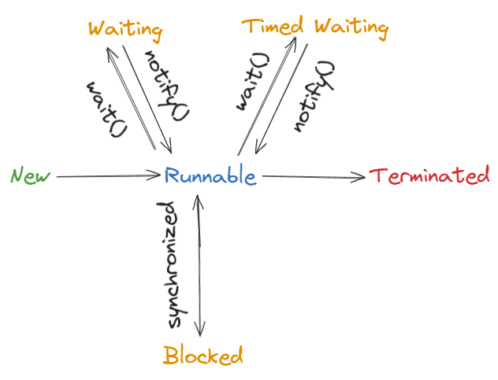
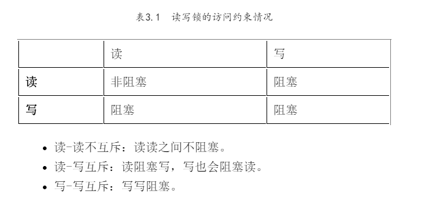
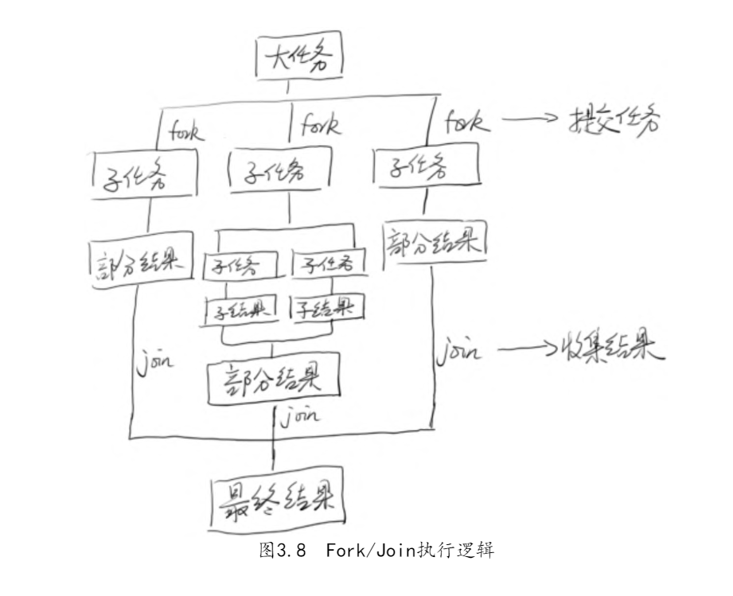

## 书籍推荐

《Javav并发编程之美》：偏向基础，讲解各种线程相关概念和使用，源码和实现

《Java并发编程实战》：偏向应用后的注意，部分场景比较难理解

《实战Java高并发程序设计》

## 1.什么是线程

执行程序的最小单位，相当于一个任务

## 2.线程的状态

NEW  
RUNNABLE  
BLOCKED  
WAITING  
TIMED_WAITING  
TERMINATED



## 3.实现线程的方法

继承Thread类，实现Runable接口，实现Callable接口

## 4.线程同步和线程安全

线程同步是保证线程安全的手段。

线程安全是指在多线程情况下读取或写入共享变量不会发生超出预期的情况。由于具有静态条件的共享变量在多线程访问时容易出现意料之外的情况，需要线程同步措施保证线程安全。

## 5.线程同步的方式有哪些

- 使用volatile修饰变量，但只能保证可见性
- 使用锁，保证可见性和原子性
- 使用原子类atomic,使用底层的CAS保证可见性和原子性
- 使用线程池或executor
- 使用ThreadLocal
- 使用线程安全的容器
- 使用栈安全的手段(对数据进行深拷贝，存储影响大)

## 6.原子性，可见性，有序性

原子性：要么同时发生要么同时失败；

可见性：共享变量的修改对其他线程可见，一个线程修改共享变量时没有将指刷入主内存时，其他线程阻塞

有序性：jvm会对无相互依赖的代码指令进行重排序，时序性指按照确定的顺序执行

Happen-Before:

程序顺序原则：一个线程内保证语义的串行性  
volatile规则：volatile变量的写，先发生于读，这保证了volatile变量的可见性  
锁规则：解锁（unlock）必然发生在随后的加锁（lock）前  
传递性：A先于B，B先于C，那么A必然先于C  
线程的start()方法先于它的每一个动作  
线程的所有操作先于线程的终结（Thread.join()）  
线程的中断（interrupt()）先于被中断线程的代码  
对象的构造函数执行、结束先于finalize()方法

## 7.锁的概念

乐观锁和悲观锁

公平锁和非公平锁

独占锁和共享锁

可重入锁

自旋锁

## 8.Object的线程相关方法

wait() 释放锁等待,需要注意需要先获取到锁才能使用

notify() 随机唤醒等待队列中的一个对象

ntifyAll()唤醒等待队列中全部的对象

## 9.Thread相关方法

interrupt() 设置中断标志位，但是不会中断线程

suspend() 废弃

resume() 废弃

sleep() 不释放锁

join() 等待线程结束  join()的本质是让调用线程wait()在当前线程对象实例上

yiled() 让出线程

## 10.ReentrantLock和synchronized

synchronized是以非公平的ReentrantLock实现的

ReentrantLock默认是非公平的

通过AbstractQueuedSynchronizer实现

其中主要通过等待链表、volatile修饰的变量、LockSupport的park()和unpark()

synchronized的几种用法：

1. 指定加锁对象
2. 修饰方法 以当前实例作为锁
3. 修饰静态方法  以class作为锁

10.1synchronized中锁的状态变化


## 11.书

### 编程之美

在表中添加 version 字段来实现乐观锁

```sql
int count = update("update table1 set name=#{name},age=#{age},version=${versi
 on}+1 where id =#{id} and version=#{version}",entry);

```

自旋锁jvm参数设置

自旋锁则是，当前线程在获取锁时，如果发现锁已经被其他线程占有，  
它不马上阻塞自己，在不放弃 CPU 使用权的情况下，多次尝试获取（默认次数是 10，可  
以使用 -XX:PreBlockSpinsh 参数设置该值）

### 实战Java

```java
try {
    task.run();
} catch (RuntimeException x) {
    thrown = x; throw x;
} catch (Error x) {
    thrown = x; throw x;
} catch (Throwable x) {
    thrown = x; throw new Error(x);
} finally {
    afterExecute(task, thrown);
}
```

## 12.框架中使用多线程的情况

### 12.1 SpringBatch

### 12.2 MyBatis

### 12.3 Spring

## 13.ETC

```shell
jstack `jps | grep IntLock | awk '{print $1}'`
```

## 14.Condtion

await()方法会使当前线程等待，同时释放当前锁

awaitUninterruptibly()方法与await()方法基本相同，但是它并不会在等待过程中响应中断

singal() 方 法 用 于 唤 醒 一 个 在 等 待 中 的 线 程

singalAll() 方 法 会 唤 醒 所 有 在 等 待 中 的 线 程

## 15. 信号量（Semaphore）

## 16.读写锁(ReadWriteLock)



## 17.倒计时器(CountDownLatch)

## 18.循环栅栏(CyclicBarrier)

## 19.LockSupport

## 20.线程安全的容器

ConcurrentHashMap：这是一个高效的并发HashMap。你可以理解为一个线程安全的HashMap。  
CopyOnWriteArrayList ： 这 是 一 个 List ， 从 名 字 看 就 是 和ArrayList是一族的。在读多写少的场合，这个List的性能非常好，远远好于Vector。  
ConcurrentLinkedQueue：高效的并发队列，使用链表实现。可以看做一个线程安全的LinkedList。  
BlockingQueue：这是一个接口，JDK内部通过链表、数组等方式实现了这个接口。表示阻塞队列，非常适合用于作为数据共享的通道。  
ConcurrentSkipListMap：跳表的实现。这是一个Map，使用跳表的数据结构进行快速查找。

CopyOnWriteArrayList类对它来说，读取是完全不用加锁的，并且更好的消息是：写入也不会阻塞读取操作，只有写入和写入之间需要进行同步等待

## 21.线程池

减少创建和销毁线程的开销

Executors的实现只是对ThreaPoolExecutor的封装

### 21.1核心参数

```java
public ThreadPoolExecutor(int corePoolSize,
 int maximumPoolSize,
 long keepAliveTime,
 TimeUnit unit,
 BlockingQueue＜Runnable＞ workQueue,
 ThreadFactory threadFactory,
 RejectedExecutionHandler handler)
```

corePoolSize：指定了线程池中的线程数量。  
maximumPoolSize：指定了线程池中的最大线程数量。  
keepAliveTime：当线程池线程数量超过corePoolSize时，多余的空闲线程的存活时间。即，超过corePoolSize   的空闲线程，在多长时间内，会被销毁。  
unit：keepAliveTime的单位。  
workQueue：任务队列，被提交但尚未被执行的任务。  
threadFactory：线程工厂，用于创建线程，一般用默认的即可。  
handler：拒绝策略。当任务太多来不及处理，如何拒绝任务。

### 21.2拒绝策略

AbortPolicy策略：该策略会直接抛出异常，阻止系统正常工作。  
CallerRunsPolicy策略：只要线程池未关闭，该策略直接在调用者线程中，运行当前被丢弃的任务。显然这样做不会真的丢弃任务，但是，任务提交线程的性能极有可能会急剧下降。  
DiscardOledestPolicy策略：该策略将丢弃最老的一个请求，也就是即将被执行的一个任务，并尝试再次提交当前任务。  
DiscardPolicy策略：该策略默默地丢弃无法处理的任务，不予任何处理。

**实现自己的拒绝策略**

**扩展RejectedExecutionHandler接口**

21.3

## 22.Fork/Join框架




## 23.提高锁的性能

1. 减少锁的持有时间，运行时间长的方法能否避免
2. 减小锁的粒度，缩小锁定的范围，map分小map,同步代码块减小
3. 读写分离锁替换独占锁
4. 锁分离
5. 锁粗化，减少对锁的获取

## 锁优化

## 24.ThreadLocal

## 25.CAS

它包含三个参数CAS(V,E,N)。V表示要更新的变量，E表示预期值，N表示新值。

AtomicInteger

AtomicReference

AtomicStampedReference

AtomicIntegerArray

SynchronousQueue

## 26.UnSafe类

