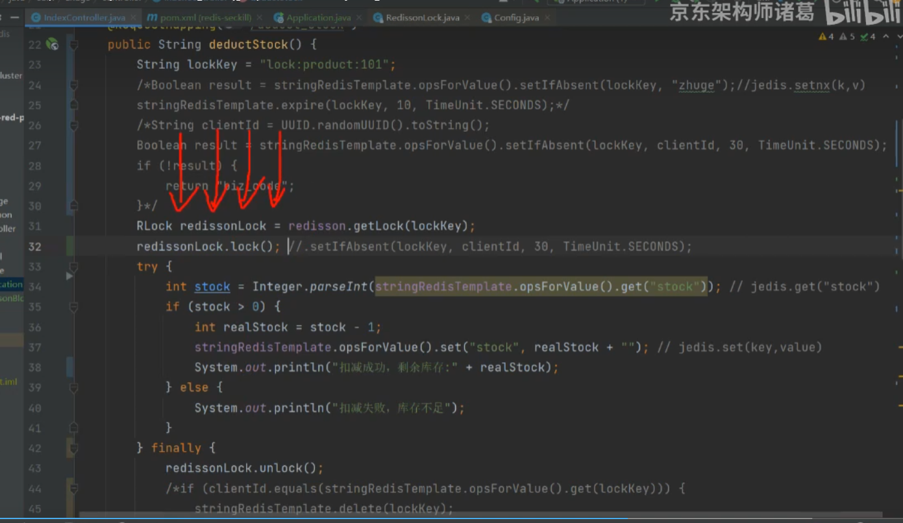
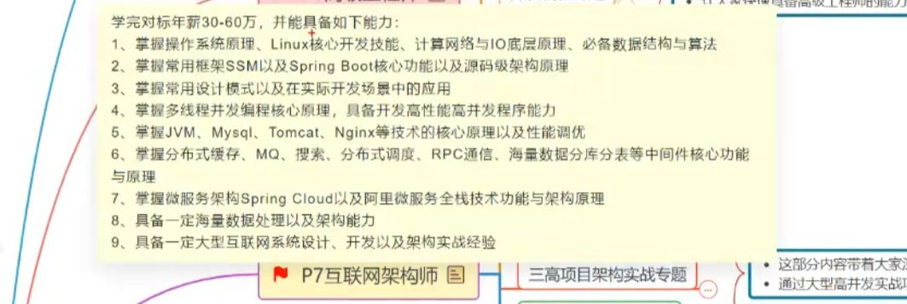

## 0.安装

- 官网：[https://redis.io](https://gitee.com/link?target=https%253A%252F%252Fredis.io)
- 中文网：[http://www.redis.net.cn/](https://gitee.com/link?target=http%253A%252F%252Fwww.redis.net.cn%252F)
- 教程: [https://blog.csdn.net/Wolf__king/article/details/129730768](https:/blog.csdn.net/Wolf__king/article/details/129730768)

1. 下载安装包解压

   ```cmd
   $ wget http://download.redis.io/releases/redis-5.0.4.tar.gz
   $ tar xzf redis-5.0.4.tar.gz
   $ cd redis-5.0.4
   $ make
   ```

   - 编译报错

     ```cmd
     /bin/sh: cc: command not found
     make[1]: *** [adlist.o] Error 127
     make[1]: Leaving directory `/approval/app/redis-5.0.4/src'
     make: *** [all] Error 2
     
     [root@localhost redis-5.0.4]# cd src/
     [root@localhost src]# make
         CC adlist.o
     In file included from adlist.c:34:0:
     zmalloc.h:50:31: fatal error: jemalloc/jemalloc.h: No such file or directory
      #include <jemalloc/jemalloc.h>
                                    ^
     compilation terminated.
     make: *** [adlist.o] Error 1
     ```

     > 解决：
     > 
     > 1. 安装gcc `yum install gcc`
     > 2. `make MALLOC=libc`


2. 修改配置(conf文件中的注释有详细说明 很棒)

   ```cmd
   $ vim redis.conf
   # 绑定的IP
   # bind 127.0.0.1
   # 密码认证
   requirepass root
   # 日志级别
   loglevel notice
   # log位置
   logfile "///"
   ```

3. 启动redis-server

   ```cmd
   /approval/app/redis-5.0.4/src/redis-server /approval/app/redis-5.0.4/src/redis.conf
   ```

4. 查询

   ```cmd
   # 没有密码
   /approval/app/redis-5.0.4/src/redis-cli
   # 有密码
   /approval/app/redis-5.0.4/src/redis-cli -h 127.0.0.1 -p 6379 -a root
   
   [root@localhost src]# ./redis-cli
   127.0.0.1:6379> auth root
   OK
   127.0.0.1:6379> keys *
   1) "6"
   ```

5. 退出

   ```cmd
   1. redis-cli shutdown
   2. redis-server--service-stop
   ```

6. 设置开机自启

```shell
[root@localhost system]# vim redis.service
[Unit]
Description=redis-server
After=network.target

[Service]
Type=forking
ExecStart=/approval/app/redis-5.0.4/src/redis-server /approval/app/redis-5.0.4/redis.conf
PrivateTmp=true

[Install]
WantedBy=muiti-user.target
[root@localhost system]# systemctl daemon-reload
[root@localhost system]# systemctl start redis
[root@localhost system]# systemctl status redis.service
● redis.service - redis-server
   Loaded: loaded (/etc/systemd/system/redis.service; disabled; vendor preset: disabled)
   Active: active (running) since Thu 2024-03-14 10:56:52 CST; 6s ago
  Process: 8071 ExecStart=/approval/app/redis-5.0.4/src/redis-server /approval/app/redis-5.0.4/redis.conf (code=exited, status=0/SUCCESS)
 Main PID: 8072 (redis-server)
    Tasks: 4
   CGroup: /system.slice/redis.service
           └─8072 /approval/app/redis-5.0.4/src/redis-server *:6379

Mar 14 10:56:52 localhost.localdomain systemd[1]: Starting redis-server...
Mar 14 10:56:52 localhost.localdomain systemd[1]: Started redis-server.
[root@localhost system]# systemctl enable redis

```

7. 

## 1.简单使用

1. **String**

   ```sql
   127.0.0.1:6379> set hello tom
   OK
   127.0.0.1:6379> get hello
   "tom"
   ```

2. **List**

   ```sql
   127.0.0.1:6379> rpush list item1
   (integer) 1
   127.0.0.1:6379> rpush list item2
   (integer) 2
   127.0.0.1:6379> rpush list item3
   (integer) 3
   127.0.0.1:6379> lrange list 0 -1
   1) "item1"
   2) "item2"
   3) "item3"
   127.0.0.1:6379> lindex list 2
   "item3"
   127.0.0.1:6379> lpop list
   "item1"
   127.0.0.1:6379> lrange list 0 -1
   1) "item2"
   2) "item3"
   
   ```

3. **Hash**

   ```sql
   127.0.0.1:6379> hset myhash car tesla
   (integer) 1
   127.0.0.1:6379> hset myhash bear weini
   (integer) 1
   127.0.0.1:6379> hset myhash car byd
   (integer) 0
   127.0.0.1:6379> hgetall myhas
   (empty list or set)
   127.0.0.1:6379> hgetall myhash
   1) "car"
   2) "byd"
   3) "bear"
   4) "weini"
   127.0.0.1:6379> hget myhash car
   "byd"
   127.0.0.1:6379> hget myhash bear
   "weini"
   127.0.0.1:6379> hdel myhash car
   (integer) 1
   127.0.0.1:6379> hgetall myhash
   1) "bear"
   2) "weini"
   127.0.0.1:6379>
   ```

4. **Set**

   ```sql
   127.0.0.1:6379> sadd myset item1
   (integer) 1
   127.0.0.1:6379> sadd myset item2
   (integer) 1
   127.0.0.1:6379> sadd myset item3
   (integer) 1
   127.0.0.1:6379>
   127.0.0.1:6379>
   127.0.0.1:6379> smembers myset
   1) "item3"
   2) "item1"
   3) "item2"
   127.0.0.1:6379> sismember myset item1
   (integer) 1
   127.0.0.1:6379> sismember myset item2
   (integer) 1
   127.0.0.1:6379>
   127.0.0.1:6379> srem myset item2
   (integer) 1
   127.0.0.1:6379> smembers myset
   1) "item3"
   2) "item1"
   127.0.0.1:6379>
   ```

5. **Sorted Set**

   ```sql
   127.0.0.1:6379> zadd myzset 100 tom
   (integer) 1
   127.0.0.1:6379> zadd myzset 200 finn
   (integer) 1
   127.0.0.1:6379> zadd myzset 300 bob
   (integer) 1
   127.0.0.1:6379> zrange myzset 0 -1 withscores
   1) "tom"
   2) "100"
   3) "finn"
   4) "200"
   5) "bob"
   6) "300"
   127.0.0.1:6379> zrangebyscore myzset 0 200 withscores
   1) "tom"
   2) "100"
   3) "finn"
   4) "200"
   127.0.0.1:6379> zrem myzset tom
   (integer) 1
   127.0.0.1:6379> zrange myzset 0 -1 withscores
   1) "finn"
   2) "200"
   3) "bob"
   4) "300"
   127.0.0.1:6379>
   ```

6. **Key**

   ```sql
   127.0.0.1:6379> keys *
   1) "myset"
   2) "myzset"
   3) "hello"
   4) "list"
   5) "6"
   6) "myhash"
   127.0.0.1:6379> keys myset
   1) "myset"
   ```

7. ETC

   ```sql
   # 1. 切换DB 切换后会显示是哪个DB 没有的话就是0 DB数量在confg文件中配置
   127.0.0.1:6379> select 2
   OK
   127.0.0.1:6379[2]> keys *
   (empty list or set)
   # 2. 显示DB信息
   INFO
   
   
   ```

8. 
9. 

````

````


## 2.Java使用redis

## 3.数据备份持久化

### 3.1持久化

1. 快照--保存某个时刻的所有数据。<b><span style="color:rgba(244,63,94,1)">如果执行时挂掉会丢失挂掉时候的数据</span></b>

   - 配置

     ```shellsession
     # 从上次快照之后60s之内写入100000次 自动触发BGSAVE
     save 900 1 
     save 300 10
     save 60 10000
     stop-writes-on-bgsave-error yes
     rdbcompression yes 压缩
     rdbchecksum yes
     dbfilename dump.rdb #文件名
     dir ./ #文件位置
     ```

   - 执行`SAVE`或者`BGSAVE`

     1. 从上次快照之后60s之内写入100000次 自动触发BGSAVE
     2. 主动执行save或者BGSAVE
     3. 服务shutdown的时候会执行save
     4. 和另外一台进行同步的时候,执行SYNC,主服务没有刚执行完BGSAVE的时候会执行BGSAVE

     ```sql
     127.0.0.1:6379> bgsave
     Background saving started
     127.0.0.1:6379> INFO persistence
     # Persistence
     loading:0
     rdb_changes_since_last_save:0
     rdb_bgsave_in_progress:0
     rdb_last_save_time:1710393003
     rdb_last_bgsave_status:ok
     rdb_last_bgsave_time_sec:0
     rdb_current_bgsave_time_sec:-1
     rdb_last_cow_size:290816
     aof_enabled:0
     aof_rewrite_in_progress:0
     aof_rewrite_scheduled:0
     aof_last_rewrite_time_sec:-1
     aof_current_rewrite_time_sec:-1
     aof_last_bgrewrite_status:ok
     aof_last_write_status:ok
     aof_last_cow_size:0
     
     ```

   - 查看 `/approval/app/redis-5.0.4/backup/dump.rdb`
   - 恢复

2. 只追加文件 AOF--只将写命令存入

   - 配置

     <code><span style="color:rgba(244,63,94,1)">appendonly yes</span></code>

     ```shellsession
     appendonly yes
     appendfilename "appendonly.aof"
     appendfsync everysec
     no-appendfsync-on-rewrite no
     auto-aof-rewrite-percentage 100
     auto-aof-rewrite-min-size 64mb
     aof-load-truncated yes
     aof-use-rdb-preamble yes
     dir ./ #文件位置
     ```

   - 执行

     根据配置中参数自动执行<code><span style="color:rgba(244,63,94,1)">appendfsync </span></code>

     always  -- 一直开启 不建议 太耗费性能

     on -- 系统决定 不好

     everysec --- 每秒一次，推荐

   - 查看 `/approval/app/redis-5.0.4/backup/appendonly.aof`
   - 恢复


## 4.主从配置

## 5.优化

## 6.常见问题

## 7.分布式锁

setnx用于加锁

redisson

Lua脚本

redis分布式锁丢失如何解决

异步方法

同步方法



redlock

分段锁

防止重复提交

