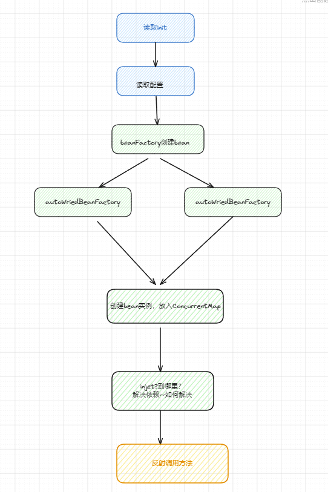

## Spring 笔记

> ***spring 官方文档***   [https://springdoc.cn/docs/](https://springdoc.cn/docs/)

1. 如何在spring boot启动时执行一些代码

   1. 通过类实现CommandLineRunner接口中的run方法
   2. 方法中加上@PostConstruct注解

## 1.IOC

对象的创建由Spring来处理

### 1.1 Bean的创建

依赖注入+控制反转

IOC

@Bean @Component @Import  @RestController @Service @Repo

ApplicationContext通过配置 读取要代理的Bean

BeanFactory生成Bean到容器

默认调用无参的构造函数

默认按照单例生成

@Autowried

### 1.2 Bean的生命周期

## 2. AOP

- JDK：实现非Bean生命周期相关的接口而且实现方法不为0
- CGlig：继承目标类

## 3. 事务

事务的使用

事务的传播机制

事务失效

